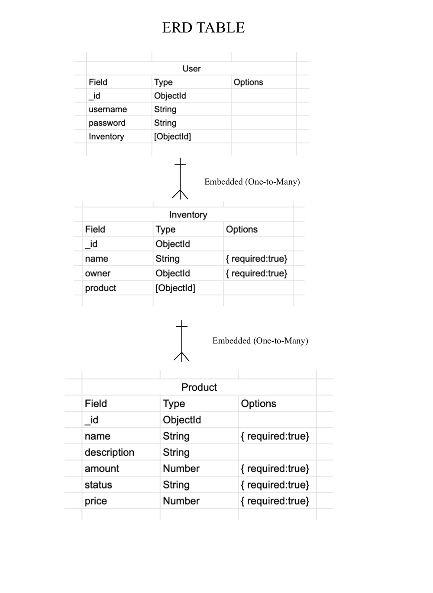
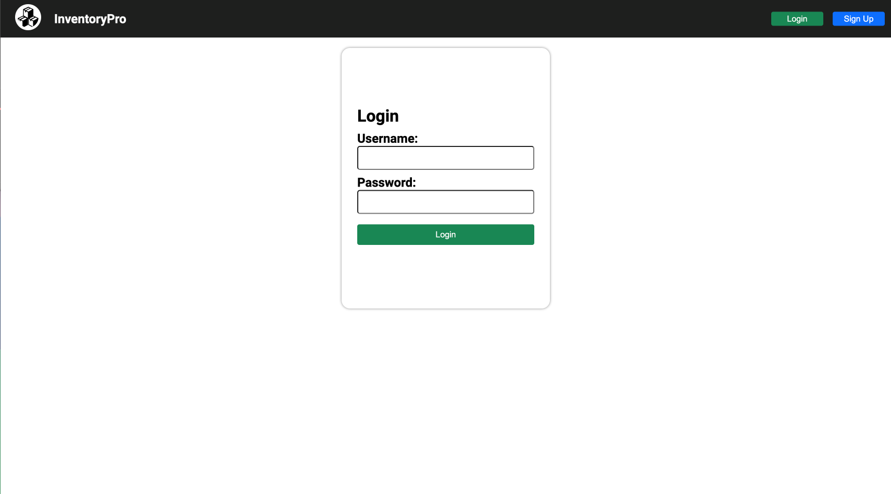

# Inventory Tracker

  

## :pencil: Descriptions:

This is an inventory management web app made using the MEN (MongoDB, Express, and Node.js) stack. The web app allows user creation and authentication. Users will be able to create, read, update, and delete products and inventories. Product images are stored locally using the Multer library. The goals of this project are to practice routing with Express, work with MongoDB, execute JavaScript outside of the browser using Node.js, and learn to store images locally using Multer.

## :computer: Getting Started:

You can access the game by clicking the link [here](n/a).

## :bust_in_silhouette: Attributions:

The documentation for the Multer Library can be found with this [link](https://www.npmjs.com/package/multer).

## :blue_book: Wireframes:

These are some page blueprints used to guide the development process.

## :camera_flash: InventoryPro Images:

## :computer: Technologies Used:

## :satellite: Next Steps:

Here are some potential improvements to the project:

- Functionality to export inventory as a PDF
- Search Bar to look up products/inventories
- Filter Products
- Sort Products
- Compatibility with mobile devices
